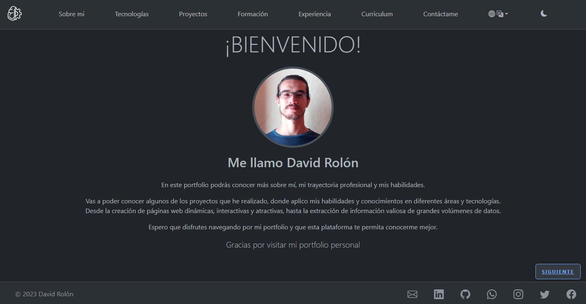
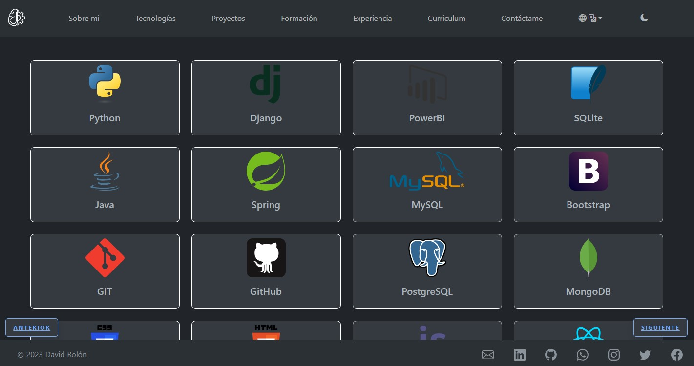
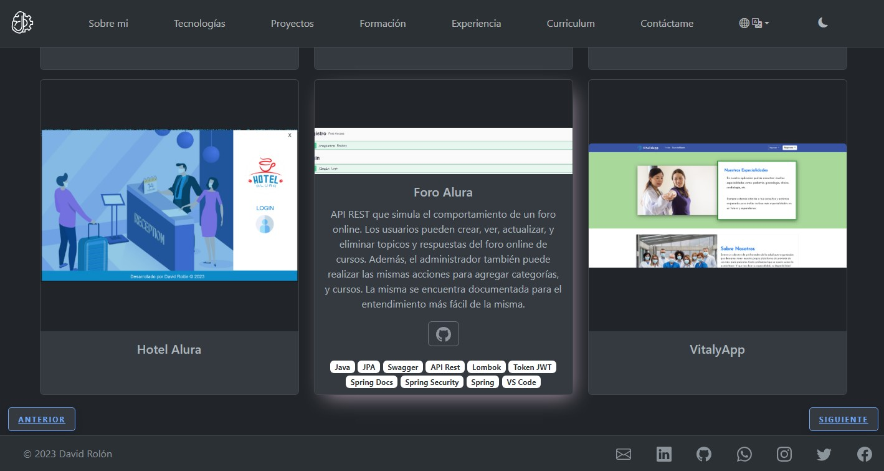
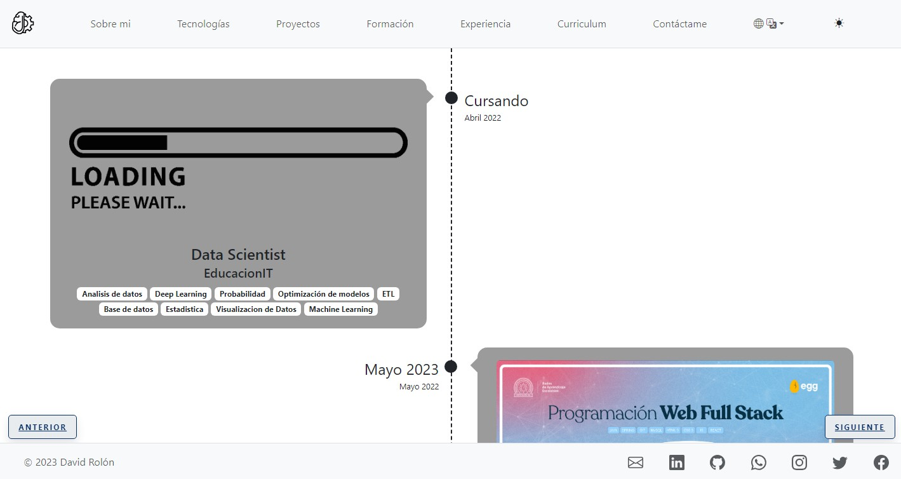
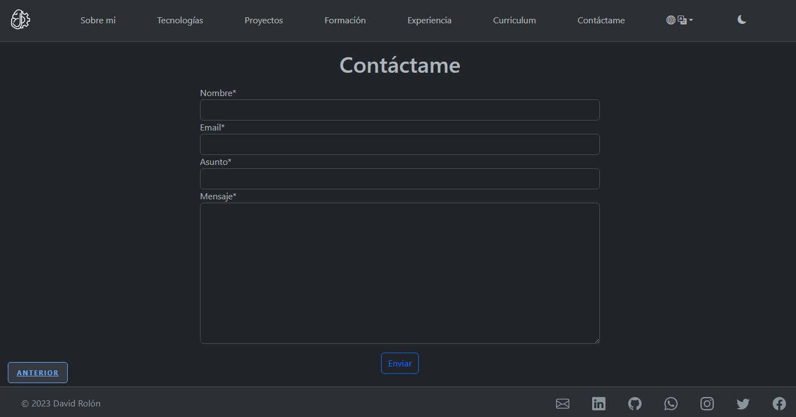
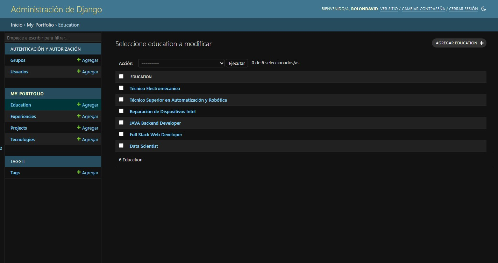

# Mi Portafolio

Quise hacer mi portafolio personal utilizando algunos de los conocimientos adquiridos de los cuales todavia no habia utilizado en ningun proyecto subido a GitHub

## Screenshots

|     |     |     |
| --- | --- | --- |
|  |  |  |
|  |  |  |

## Tech Stack

**Client:** HTML, CSS, Bootstrap, JavaScript

**Server:** Python, DJango


## Features

- Modo oscuro y  claro
- Modificación rapida desde el panel de administrador
- Responsivo
- Función contactame mediante envio de email


## Demo

Le dejo para que disfruten el deploy del mi portfolio

[David Rolón - Portfolio](http://rolondavid.pythonanywhere.com/)

## Instalación

Este proyecto se ejecuto en la version de Python 3.11.3, asi que se recomienda instalar la misma version desde la pagina oficial

[Python.org](https://www.python.org/)

Complemetario a eso necesita instalar las dependecias necesarias para el correcto funcinamiento del mismo utilizando el siguiente comando

```bash
pip install --upgrade -r requirements.txt
```

Una vez instalado puede clonar el repositorio en la carpeta que usted desee
## Variables de entorno

Ademas sera necesario crear el archivo .env en la carpeta my_portfolio. Y se debe llenar las siguientes variables de entorno

```bash
EMAIL_HOST='YOUR EMAIL HOST'
EMAIL_HOST_USER='YOUR EMAIL ADDRESS'
EMAIL_HOST_PASSWORD='YOUR EMAIL APP PASSWORD'
EMAIL_PORT='YOUR EMAIL PORT'
EMAIL_USE_TLS='True for TLS; False for SSL'
```

Se recomienda generar contraseñas de aplicaciones por motivos de seguridad, dejo algunos guias de como generarlos

[App Password Google Tutorial](https://support.google.com/accounts/answer/185833?hl=es)

[App Password Microsoft Tutorial](https://support.microsoft.com/en-us/account-billing/using-app-passwords-with-apps-that-don-t-support-two-step-verification-5896ed9b-4263-e681-128a-a6f2979a7944)

Ademas dejo el link para sabes que puerto y url de servidor son los mejores para usted

[Host and Port Table](https://apps.mexagon.net/clientes/knowledgebase/104/iCual-es-el-Host-y-el-puerto-SMTP-de-mi-servidor-de-Mail-.html)

Para poder agregar, eliminar o modificar las tecnologias, projectos, formación o experiencia desde el panel de administrador de Django es necesario crear un usuario con el siguiente comando:

```bash
python .\manage.py createsuperuser
```

Y completar con los datos requeridos
## Correr localmente
Para correr el proyecto de forma local, ejecute el siguiente comando en la carpeta raiz del proyecto

```bash
  python .\manage.py runserver
```

Ahora puede ingresar el mismo en su navegador desde:
http://localhost:8000/ o http://127.0.0.1:8000/


## Deployment

En caso de querer realizar un deploy tiene que tener en cuenta algunas consideraciones:

En settings.py debera desactivar el modo depuración

```bash
DEBUG = False
```

Ademas debera configurar la lista donde se debe indicar las direcciones de IP o dominios en los que se provee la aplicación web en el ambiente de producción en settings.py

```bash
ALLOWED_HOSTS = []
```

Tambien acuerdese de configurar la carpeta root dpara los archivos estaticos

```bash
STATIC_ROOT = 'your_location'
```